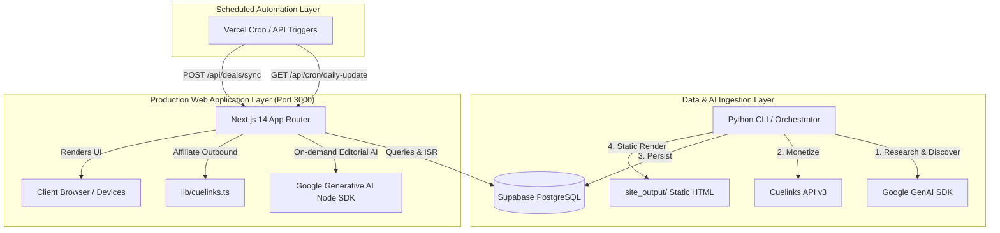
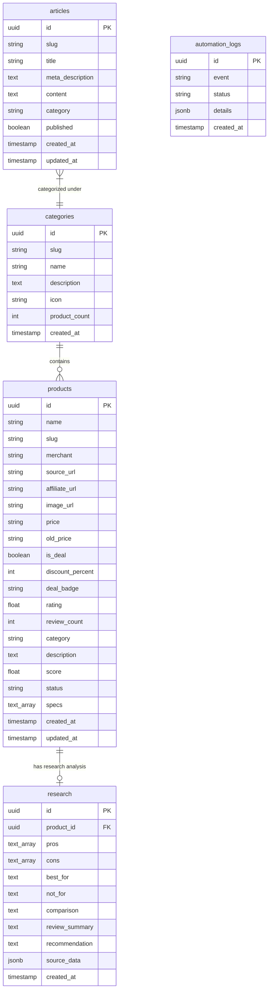

# System Architecture: SmartPick / AffiliateAgent Platform

## 1. Executive Summary & Dual-Stack Architecture

The repository represents a hybrid system combining an **autonomous AI research & publishing pipeline** with a **production-grade Next.js 14 web application**. 

The system originated as a Python CLI multi-agent framework (originally drafted around Claude SDK, then refactored to Google Gemini + Cuelinks) that generates static websites (`site_output/`). It has since evolved into a modern, responsive **Next.js App Router dynamic web platform** powered by **Supabase PostgreSQL** and **Google Gemini 2.5 Flash**.



---

## 2. Active Next.js Application Root

- **Root Directory**: `affiliate-agent/` (co-located at project root)
- **Framework**: Next.js `14.2.24` (App Router)
- **Node Engine / Language**: Node.js 18+ / TypeScript `5.7.3`
- **Configuration Files**:
  - `next.config.mjs`: Configures wildcard remote image domains (`https://**`) and experimental external server components packages.
  - `tsconfig.json`: TypeScript compiler settings with path alias `@/* -> ./*`.
  - `tailwind.config.ts`: Extended color palettes, theme tokens, and typography plugins.
  - `postcss.config.js`: Tailwind and Autoprefixer hooks.
  - `package.json`: Node dependencies, scripts (`dev`, `build`, `start`, `lint`).

---

## 3. All Next.js Routes

The application uses Next.js App Router (`app/`) with Incremental Static Regeneration (`revalidate = 60` seconds):

| Route Path | File Location | Rendering Strategy | Description |
| :--- | :--- | :--- | :--- |
| `/` | `app/page.tsx` | ISR (`revalidate = 60`) | Homepage with Hero search, trust stats, deal spotlight, category grid, comparison highlight, and buying guides. |
| `/admin` | `app/admin/page.tsx` | Client Component (`"use client"`) | Operations dashboard to manually trigger deals synchronization, run daily cron updates, test Gemini analysis, and inspect automation logs. |
| `/category/[slug]` | `app/category/[slug]/page.tsx` | ISR (`revalidate = 60`) | Dynamic category showcase filtering active deals and ranked picks for a category (e.g., `smart-home`, `audio`). |
| `/compare` | `app/compare/page.tsx` | ISR (`revalidate = 60`) | Head-to-head comparison hub pairing catalog items for side-by-side spec showdowns. |
| `/compare/[slug]` | `app/compare/[slug]/page.tsx` | ISR (`revalidate = 60`) | Dynamic comparison page parsing two product slugs (`slugA-vs-slugB`), rendering side-by-side hardware spec tables, winner badge, and verdicts. |
| `/deals` | `app/deals/page.tsx` | ISR (`revalidate = 60`) | Filterable live deal stream supporting search query `?q=`, category filter `?category=`, and minimum discount filter `?minDiscount=`. |
| `/guides` | `app/guides/page.tsx` | ISR (`revalidate = 60`) | Editorial buying guides index displaying published long-form articles. |
| `/guides/[slug]` | `app/guides/[slug]/page.tsx` | ISR (`revalidate = 60`) | In-depth buying guide reader with reading time, table of contents, buying advice, and embedded JSON-LD schema. |
| `/product/[slug]` | `app/product/[slug]/page.tsx` | ISR (`revalidate = 60`) | Single product deep-dive with verified merchant pricing, pros/cons breakdown, lab synthesis, FAQ section, alternative comparison links, and Product JSON-LD schema. |

---

## 4. Next.js API Routes

All API handlers are defined under `app/api/`:

### 1. `POST /api/agent/research`
- **File**: `app/api/agent/research/route.ts`
- **Purpose**: Runs Gemini 2.5 Flash editorial analysis on a specified product name, specs, and category without hallucinating false specs.
- **Database Action**: If `productId` is provided in the JSON body, upserts the resulting analysis (pros, cons, best_for, not_for, comparison, review_summary, recommendation) into the Supabase `research` table.
- **Request Body**:
  ```json
  {
    "productId": "uuid-optional",
    "productName": "Sony WH-1000XM5",
    "specs": ["30hr battery", "ANC V1 processor"],
    "category": "Audio"
  }
  ```

### 2. `GET /api/cron/daily-update`
- **File**: `app/api/cron/daily-update/route.ts`
- **Purpose**: Daily automated maintenance pipeline trigger (designed for Vercel Cron or external curl).
- **Security**: Validates `Authorization: Bearer <CRON_SECRET>` if `CRON_SECRET` is configured.
- **Database Action**: Inserts an audit record into the Supabase `automation_logs` table recording the event and timestamp.

### 3. `POST /api/deals/sync`
- **File**: `app/api/deals/sync/route.ts`
- **Purpose**: Scans all records in Supabase `products` table where `old_price` is present and flags `is_deal: true`.
- **Database Action**: Updates matching product records with deal flags and discount percentages.

---

## 5. Components Architecture

Components are organized into domain components (`components/`) and UI primitives (`components/ui/`):

### Domain & Layout Components
- **`components/navbar.tsx`**: Sticky responsive header with brand logo, desktop navigation links, mobile drawer menu, and quick-search focus shortcut (`Cmd+K`).
- **`components/footer.tsx`**: Comprehensive site footer with category directory, editorial standards trust badge, disclaimer, and secondary navigation.
- **`components/disclosure-bar.tsx`**: Prominent top banner with FTC affiliate disclosure ("We may earn a commission when you purchase through links on our site...").
- **`components/hero-section.tsx`**: Hero header featuring headline, live search bar with direct routing to `/deals?q=`, and a visual spotlight card for the top deal of the day.
- **`components/trust-strip.tsx`**: Statistical trust strip displaying verified catalog counts, researched buying guides, zero sponsored bias guarantee, and editorial standards.
- **`components/product-card.tsx`**: Editorial product card displaying ranked badge (`#1 Ranked Pick`), score/100, photo with hover zoom, rating, verified specs checklist, and price.
- **`components/deal-card.tsx`**: Compact deal card highlighting discount badge (`% OFF`), merchant source, rating, current vs old price, and direct outbound affiliate link.
- **`components/category-card.tsx`**: Interactive card linking to `/category/[slug]` with product counts and category descriptions.
- **`components/comparison-card.tsx`**: Preview card contrasting two competing products with a winner pill and quick link to `/compare/[slug]`.
- **`components/comparison-feature.tsx`**: Visual side-by-side section on the homepage highlighting a direct hardware spec showdown.
- **`components/guide-card.tsx`**: Magazine-style card for buying guides and tutorials with category pill and read time indicator.
- **`components/newsletter-section.tsx`**: Deal alert email subscription card with privacy assurance and spam protection guarantee.
- **`components/json-ld.tsx`**: Schema.org JSON-LD generators for `WebSite`, `Organization`, `Product`, and `Article`.

### UI Primitives (`components/ui/`)
- **`components/ui/button.tsx`**: Reusable button variant system powered by `class-variance-authority` (supports `default`, `destructive`, `outline`, `secondary`, `ghost`, `link`, `deal`, `hero`).
- **`components/ui/card.tsx`**: Scaffolding card component (currently unused in production pages; contains dark-theme classes).
- **`components/ui/badge.tsx`**: CVA-based badge primitive (currently unused in production pages; domain components use custom inline pill styling).

---

## 6. Lib Utilities

- **`lib/supabase.ts`**:
  - Initializes Supabase JavaScript client (`@supabase/supabase-js`) using `SUPABASE_URL` and `SUPABASE_ANON_KEY`.
  - Exposes typed query functions:
    - `getProducts(limit)`: Retrieves active products ordered by score.
    - `getProductBySlug(slug)`: Retrieves product record + attached research record.
    - `getDeals(limit)`: Filters products where `is_deal = true` ordered by discount.
    - `getCategories()`: Fetches all categories ordered by product count.
    - `getCategoryBySlug(slug)`: Fetches category record + related products.
    - `getArticles(limit)` / `getArticleBySlug(slug)`: Retrieves published buying guides.
    - `getAutomationLogs(limit)`: Fetches cron execution logs.
- **`lib/gemini.ts`**:
  - Initializes `@google/generative-ai` with `GEMINI_API_KEY`.
  - Implements `analyzeProductWithGemini(productName, specs, category)` using `gemini-2.5-flash`.
  - Strictly instructs the model not to invent false specs, requesting structured JSON with pros, cons, best_for, not_for, comparison, review_summary, and recommendation.
  - Includes robust offline fallback defaults in case the API key is unset or an error occurs.
- **`lib/cuelinks.ts`**:
  - Controls affiliate URL monetization resolution.
  - Supports a disconnected mode (clean merchant URLs) and an active redirect mode (`/api/redirect?url=...`).
- **`lib/types.ts`**:
  - TypeScript interfaces for `Product`, `Research`, `Category`, `Article`, `AutomationLog`, `ComparisonPair`.
- **`lib/utils.ts`**:
  - `cn(...inputs)`: Tailwind class merger using `clsx` and `tailwind-merge`.
  - `formatPrice(price)`: Currency formatting utility.
  - `calculateDiscount(price, oldPrice)`: Calculates integer percentage discount from currency strings.

---

## 7. Supabase Integration

- **Project ID**: `mlsbumavmkbdislnhwvb`
- **Project Name**: `affiliates deals`
- **Region**: `ap-northeast-2`
- **Database Engine**: PostgreSQL 17.6

### Schema & Tables



### Table Stats (Audited via Supabase API)
- `products`: 26 active rows
- `research`: 26 active rows
- `categories`: 7 active rows
- `articles`: 3 active rows
- `automation_logs`: 2 active rows

---

## 8. Gemini Integration

The repository uses Google Gemini across both layers:

1. **Next.js Layer (`lib/gemini.ts`)**:
   - SDK: `@google/generative-ai` v0.21.0
   - Model: `gemini-2.5-flash`
   - Role: Real-time on-demand product research synthesis and editorial analysis.
2. **Python Pipeline Layer (`src/affiliate_agent/core/gemini.py`)**:
   - SDK: `google-genai` (official new Google GenAI Python SDK)
   - Model: `gemini-2.5-flash` (customizable via `GEMINI_MODEL`)
   - Role: Batch content generation for articles, structured product data extraction, and meta-tag optimization.

---

## 9. CSS / Tailwind Architecture

- **Engine**: TailwindCSS v3.4.17
- **Base Style System**: HSL CSS Variables configured in `app/globals.css` (`--background`, `--foreground`, `--primary`, `--deal`, `--border`, `--radius`).
- **Typography**: Inter (Google Fonts via `next/font/google` in `app/layout.tsx`).
- **Design Aesthetic**: Clean, high-contrast light theme (soft background `#fafafa`, white card surfaces, crisp slate borders `#e2e8f0`, vibrant blue `#2563eb` interactive accents, and emerald green `#10b981` deal indicators).
- **Key Custom Utility Classes**:
  - `.editorial-card`: Bordered white card with subtle hover translation (`translateY(-2px)`) and elevation shadow.
  - `.product-photo-wrap`: Centered image container with slate background.
  - `.deal-pill`: Emerald green pill with bold percentage tag.

---

## 10. Static & Legacy Files

- **`site_output/`**: Static website generated by the Python `PublisherAgent`. Contains 36 pre-rendered HTML/CSS/XML files (index, category pages, review pages, `rss.xml`, `sitemap.xml`, `robots.txt`).
- **`generate_guide_pdf.py` & `generate_marketplace_pdf.py`**: Standalone Python scripts using ReportLab to build PDF documentation books (`AffiliateAgent-Guide.pdf`, `AffiliateAgent-Marketplace-Guide.pdf`).
- **`setup.sh` & `setup_windows.py`**: CLI installer scripts for bootstrapping a Python virtual environment and running the legacy Python CLI.
- **`README.md`**: Legacy documentation referencing Claude Agent SDK and Claude CLI.

---

## 11. Purpose of `site_output/`

`site_output/` is the export target of the Python CLI (`affiliate-agent pipeline` and `affiliate-agent publish`). It contains:
- Fully static HTML files compiled using Jinja2 templates (`src/affiliate_agent/templates/site/`).
- Injected Cuelinks tracking scripts (`cuelinks.js` snippet).
- Static `sitemap.xml` and `rss.xml` feeds.
- Can be previewed locally on port 8000 via `affiliate-agent serve`.
- **Relationship to Next.js**: Completely independent. The Next.js app does not read from or serve `site_output/`.

---

## 12. Purpose of `src/`

`src/` contains the `affiliate_agent` Python package:
- `affiliate_agent/agents/`:
  - `product_finder.py`: Discovers affiliate products and formats specs.
  - `research_writer.py`: Generates long-form markdown articles and buying guides.
  - `seo_optimizer.py`: Injects SEO meta tags and JSON-LD schemas into articles.
  - `publisher.py`: Compiles HTML and copies assets into `site_output/`.
  - `orchestrator.py`: Coordinates the 4-stage pipeline.
- `affiliate_agent/core/`:
  - `gemini.py`: Python client for Gemini.
  - `supabase_manager.py`: Connects Python pipeline to Supabase database.
- `affiliate_agent/tools/`: Domain data tools for niches, products, content, and performance.
- `affiliate_agent/utils/cuelinks.py`: Full Cuelinks API v3 client with campaign discovery and link conversion.
- `affiliate_agent/templates/site/`: Jinja2 templates (`base.html`, `index.html`, `category.html`, `article.html`, `styles.css`).

---

## 13. Build & Deployment Entry Points

### Next.js Production Build
- **Entry**: `package.json`
- **Commands**:
  - Development: `npm run dev` (starts on `http://localhost:3000`)
  - Production Build: `npm run build`
  - Production Start: `npm run start`
- **Hosting Target**: Vercel, Netlify, or Node.js container.

### Python CLI Entry
- **Entry**: `pyproject.toml` (`[project.scripts] affiliate-agent = "affiliate_agent.cli:main"`)
- **Commands**:
  - `affiliate-agent pipeline`: Runs complete 4-agent workflow.
  - `affiliate-agent daily-update`: Rotates deals and rebuilds static site.
  - `affiliate-agent serve`: Hosts `site_output/` on `http://localhost:8000`.
  - `affiliate-agent chat`: Interactive console chat with Gemini.

---

## 14. Environment Variables

| Variable | Used By | Required? | Purpose |
| :--- | :--- | :--- | :--- |
| `NEXT_PUBLIC_SUPABASE_URL` or `SUPABASE_URL` | Next.js & Python | **Yes** | Supabase REST / GraphQL API URL |
| `NEXT_PUBLIC_SUPABASE_ANON_KEY` or `SUPABASE_ANON_KEY` or `SUPABASE_KEY` | Next.js & Python | **Yes** | Public/Anon Supabase Client Key |
| `GEMINI_API_KEY` | Next.js & Python | **Yes** | Google Gemini API Key |
| `GEMINI_MODEL` | Python | No (Default: `gemini-2.5-flash`) | Model selector for Python agent |
| `CUELINKS_API_KEY` | Next.js & Python | No (Monetization) | Cuelinks Publisher API v3 key |
| `CUELINKS_PUBLISHER_ID` | Next.js & Python | No (Monetization) | Cuelinks publisher account ID |
| `CUELINKS_CAMPAIGN_ID` | Next.js & Python | No | Optional SubID / channel tag |
| `CUELINKS_ENABLED` | Next.js | No (Default: `false`) | Enables outbound affiliate link routing |
| `CRON_SECRET` | Next.js | No (Security) | Protects `/api/cron/daily-update` endpoint |
| `SITE_URL` | Next.js & Python | No (Default: `https://smartpick.reviews`) | Canonical URL base for metadata & JSON-LD |
| `SITE_NAME` | Next.js & Python | No (Default: `SmartPick Reviews`) | Public site name branding |

---

## 15. Existing Automation

1. **Next.js Cron API**:
   - `/api/cron/daily-update`: Automation endpoint designed for Vercel Cron. Inserts execution timestamps into `automation_logs`.
   - `/api/deals/sync`: Batch updates products where `old_price` is lower than regular price to mark them as active deals.
2. **Python Daily Update Orchestrator**:
   - `affiliate-agent daily-update`: Selects Deal of the Day based on highest discount/score, rotates featured categories, rebuilds `site_output/`, and writes an execution log to `output/daily_reports/update-YYYY-MM-DD.json`.
3. **Admin Panel Manual Triggers**:
   - `/admin` allows single-click execution of Deal Sync, Daily Cron, and AI Product Research.

---

## 16. Existing SEO & JSON-LD

- **Root Metadata**: `app/layout.tsx` defines default Title, Description, OpenGraph tags, Twitter summary card, metadataBase, and canonical URL.
- **Structured Data Components**:
  - `components/json-ld.tsx` generates valid Schema.org definitions:
    - `WebSite`: includes `SearchAction` deep-link into `/deals?q=...`.
    - `Organization`: includes brand name and logo URL.
    - `Product`: includes merchant name, current price, currency (`USD`), availability (`InStock`), and conditional `AggregateRating` (only rendered when legitimate ratings exist).
    - `Article`: includes headline, author organization, datePublished, and dateModified.
- **Robots & Sitemaps**:
  - `site_output/` has static `robots.txt` and `sitemap.xml`.
  - Next.js currently relies on root layout metadata and does not yet have dynamic `app/sitemap.ts` or `app/robots.ts`.

---

## 17. Existing Affiliate Integration

- **Monetization Layer**: Cuelinks Affiliate Network (supporting Amazon, Flipkart, Croma, Myntra, Tata CLiQ, etc.).
- **Link Formatting**:
  - In Next.js: Direct links on product cards and detail pages render with `rel="nofollow sponsored"` and `target="_blank"`.
  - In Python publisher: Injects Cuelinks JavaScript widget (`https://cdn.cuelinks.com/js/cuelinksv2.js`) for client-side auto-tagging, with an offline fallback direct redirector.
- **FTC Compliance**:
  - Visual disclosure bar rendered at the top of every page (`components/disclosure-bar.tsx`).
  - Disclosure snippet included in Python templates and articles.
