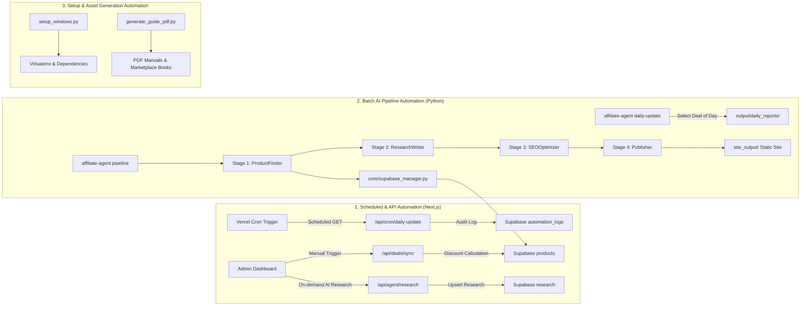

# Automation Map: SmartPick / AffiliateAgent Platform

This document maps all automation pipelines, scheduled cron tasks, AI agents, database synchronizations, and utility scripts across the repository.

---

## 1. Automation System Overview

The system includes multiple automation layers operating across the Next.js runtime and the Python agent environment:



---

## 2. Inventory of Automated Pipelines

### Pipeline 1: Next.js Daily Maintenance Cron
- **Endpoint**: `GET /api/cron/daily-update` ([app/api/cron/daily-update/route.ts](file:///c:/Users/sbixb/Downloads/affiliate%20marketing/affiliate-agent/app/api/cron/daily-update/route.ts))
- **Trigger**: External HTTP request with optional `Authorization: Bearer <CRON_SECRET>` (e.g., Vercel Cron, GitHub Actions, or Linux crontab).
- **Execution Frequency**: Recommended daily at 00:00 UTC.
- **Workflow**:
  1. Checks authorization header against `process.env.CRON_SECRET`.
  2. Generates current ISO timestamp.
  3. Writes an entry into the Supabase `automation_logs` table:
     ```json
     {
       "event": "daily_update_cron",
       "status": "success",
       "details": {
         "deals_reviewed": 26,
         "action": "Rotated daily deals and refreshed spotlight scores"
       }
     }
     ```
  4. Returns JSON `{ success: true, timestamp: "..." }`.
- **Failure Modes**: Returns HTTP 401 if unauthorized; returns HTTP 500 if Supabase connection fails.

---

### Pipeline 2: Live Deals Synchronization
- **Endpoint**: `POST /api/deals/sync` ([app/api/deals/sync/route.ts](file:///c:/Users/sbixb/Downloads/affiliate%20marketing/affiliate-agent/app/api/deals/sync/route.ts))
- **Trigger**: Manual trigger from `/admin` dashboard or webhook from merchant price feed.
- **Workflow**:
  1. Queries Supabase for all products with `price` and `old_price`.
  2. Identifies products where `old_price` indicates a discount.
  3. Updates matching rows in Supabase `products` with `is_deal: true`.
- **Known Gap**: Currently hardcodes `discount_percent: 20` and `deal_badge: "20% OFF"` instead of computing dynamic math via `lib/utils.ts`.

---

### Pipeline 3: Autonomous AI Editorial Research
- **Endpoint**: `POST /api/agent/research` ([app/api/agent/research/route.ts](file:///c:/Users/sbixb/Downloads/affiliate%20marketing/affiliate-agent/app/api/agent/research/route.ts))
- **Trigger**: Admin dashboard or internal catalog ingestion.
- **Inputs**: `productId`, `productName`, `specs`, `category`.
- **Workflow**:
  1. Calls `analyzeProductWithGemini()` using `gemini-2.5-flash`.
  2. Synthesizes pros, cons, target buyer persona (`best_for`), non-ideal buyers (`not_for`), competitive comparisons, customer sentiment summary, and buying recommendation.
  3. Automatically upserts the result into the Supabase `research` table keyed by `product_id`.

---

### Pipeline 4: Python Multi-Agent Content & Site Publishing Pipeline
- **Entry Command**: `affiliate-agent pipeline` ([src/affiliate_agent/cli.py](file:///c:/Users/sbixb/Downloads/affiliate%20marketing/affiliate-agent/src/affiliate_agent/cli.py))
- **Orchestrator**: `AffiliatePipelineOrchestrator` in `src/affiliate_agent/agents/orchestrator.py`
- **Stages**:
  1. **Stage 1: ProductFinder** ([src/affiliate_agent/agents/product_finder.py](file:///c:/Users/sbixb/Downloads/affiliate%20marketing/affiliate-agent/src/affiliate_agent/agents/product_finder.py))
     - Discovers 20–50 products across categories.
     - Maps products to merchant URLs and formats affiliate links.
     - Saves catalog to `output/products_catalog.json`.
     - Syncs catalog to Supabase `products` table via `SupabaseManager`.
  2. **Stage 2: ResearchWriter** ([src/affiliate_agent/agents/research_writer.py](file:///c:/Users/sbixb/Downloads/affiliate%20marketing/affiliate-agent/src/affiliate_agent/agents/research_writer.py))
     - Takes product catalog and drafts 10–20 comprehensive articles (in-depth reviews, category buying guides, comparisons).
     - Saves markdown files to `output/articles/`.
  3. **Stage 3: SEOOptimizer** ([src/affiliate_agent/agents/seo_optimizer.py](file:///c:/Users/sbixb/Downloads/affiliate%20marketing/affiliate-agent/src/affiliate_agent/agents/seo_optimizer.py))
     - Analyzes keyword density, generates meta descriptions, ensures single H1 structure, and builds Schema.org JSON-LD scripts.
  4. **Stage 4: Publisher** ([src/affiliate_agent/agents/publisher.py](file:///c:/Users/sbixb/Downloads/affiliate%20marketing/affiliate-agent/src/affiliate_agent/agents/publisher.py))
     - Compiles Jinja2 templates into static HTML in `site_output/`.
     - Injects Cuelinks tracking scripts and FTC disclosure banners.
     - Emits `sitemap.xml` and `rss.xml`.

---

### Pipeline 5: Python Daily Update Cron
- **Entry Command**: `affiliate-agent daily-update`
- **Workflow**:
  1. Reads `output/products_catalog.json`.
  2. Automatically selects the "Deal of the Day" using price discounts and ratings.
  3. Rebuilds `site_output/` static files with updated spotlight banners.
  4. Emits a dated status report into `output/daily_reports/update-YYYY-MM-DD.json`.

---

### Pipeline 6: Documentation & Onboarding Automation
- **Installers**:
  - `setup_windows.py`: Interactive Windows installer checking Python 3.10+, creating `.venv`, installing dependencies via `pip install -e .`, testing CLI commands, and prompting for API keys.
  - `setup.sh`: Equivalent installer for Unix/Linux/macOS systems.
- **PDF Generation**:
  - `generate_guide_pdf.py` & `generate_marketplace_pdf.py`: Uses ReportLab to generate publication-grade PDF user manuals with custom color palettes, tables, flowcharts, and callouts.

---

## 3. Automation Data Flows & Trigger Map

| Automation Task | Trigger Type | Primary Tool / Model | Storage / Output Target | Monitoring / Logging |
| :--- | :--- | :--- | :--- | :--- |
| **Product Analysis** | HTTP POST `/api/agent/research` | Gemini 2.5 Flash (`lib/gemini.ts`) | Supabase `research` table | Console output & API response |
| **Price / Deal Sync** | HTTP POST `/api/deals/sync` | Next.js Server Route | Supabase `products` table | API response (`deals_synced: N`) |
| **Daily Cron Heartbeat** | HTTP GET `/api/cron/daily-update` | Next.js Server Route | Supabase `automation_logs` table | Logged in `automation_logs` table |
| **Catalog Research** | CLI: `affiliate-agent find-products` | Gemini + Cuelinks API v3 | `output/products_catalog.json` & Supabase | Rich console tables & logs |
| **Article Drafting** | CLI: `affiliate-agent write-content` | Gemini 2.5 Flash | `output/articles/*.md` | Rich console progress |
| **Static Site Publishing** | CLI: `affiliate-agent publish` | Jinja2 + Python | `site_output/` static files | Console confirmation |
| **Daily Site Refresh** | CLI: `affiliate-agent daily-update` | Python Orchestrator | `output/daily_reports/*.json` | JSON report file |

---

## 4. Gaps in Current Automation & Recommended Enhancements

1. **Vercel Cron Automation Disconnect**:
   - The endpoint `/api/cron/daily-update` exists, but there is no `vercel.json` crons configuration file in the repository to schedule it automatically on Vercel deployment.
   - *Recommendation*: Add a `vercel.json` with:
     ```json
     {
       "crons": [
         {
           "path": "/api/cron/daily-update",
           "schedule": "0 0 * * *"
         }
       ]
     }
     ```
2. **Deals Sync Math**:
   - `/api/deals/sync` does not use dynamic discount calculation. Connecting it to `calculateDiscount()` in `lib/utils.ts` will make discount badges accurate.
3. **Database-Driven Dynamic Sitemaps**:
   - `site_output/sitemap.xml` is static. Next.js can implement `app/sitemap.ts` to automatically query Supabase products and generate live sitemaps on the fly for search engines.
4. **Automated Click Tracking & Redirection**:
   - Creating `app/api/redirect/route.ts` completes the automated affiliate tracking loop for the Next.js web application.
