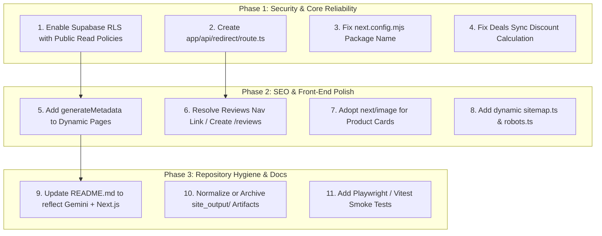

# Technical Debt & Vulnerability Audit: SmartPick / AffiliateAgent

This document audits all known technical debt, architectural discrepancies, broken references, security vulnerabilities, and obsolete files across the repository. **No destructive changes have been made.**

---

## 1. Severity Matrix

| Issue ID | Category | Severity | File / Component | Summary |
| :--- | :--- | :--- | :--- | :--- |
| **SEC-01** | Security | **CRITICAL** | Supabase Project (`mlsbumavmkbdislnhwvb`) | Row Level Security (RLS) is disabled across all 5 production tables. |
| **BUG-01** | Routing | **HIGH** | [lib/cuelinks.ts](file:///c:/Users/sbixb/Downloads/affiliate%20marketing/affiliate-agent/lib/cuelinks.ts) | Missing `/api/redirect` route causes HTTP 404 when Cuelinks is enabled. |
| **CFG-01** | Configuration | **HIGH** | [next.config.mjs](file:///c:/Users/sbixb/Downloads/affiliate%20marketing/affiliate-agent/next.config.mjs) | Package mismatch: references `@google/genai` instead of `@google/generative-ai`. |
| **LOGIC-01**| Logic | **HIGH** | [app/api/deals/sync/route.ts](file:///c:/Users/sbixb/Downloads/affiliate%20marketing/affiliate-agent/app/api/deals/sync/route.ts) | Hardcoded 20% discount override ignores actual pricing math. |
| **SEO-01** | SEO | **MEDIUM** | Dynamic App Pages (`[slug]/page.tsx`) | Missing dynamic `generateMetadata()` on dynamic product, guide, category, and comparison pages. |
| **UX-01**  | Navigation | **MEDIUM** | [components/navbar.tsx](file:///c:/Users/sbixb/Downloads/affiliate%20marketing/affiliate-agent/components/navbar.tsx), [components/footer.tsx](file:///c:/Users/sbixb/Downloads/affiliate%20marketing/affiliate-agent/components/footer.tsx) | "Reviews" link navigates to `/deals` because no `/reviews` route exists in Next.js. |
| **PERF-01**| Performance | **MEDIUM** | [components/product-card.tsx](file:///c:/Users/sbixb/Downloads/affiliate%20marketing/affiliate-agent/components/product-card.tsx), [components/deal-card.tsx](file:///c:/Users/sbixb/Downloads/affiliate%20marketing/affiliate-agent/components/deal-card.tsx) | Unoptimized native `` tags used instead of Next.js `<Image />`. |
| **DEAD-01**| Dead Code | **MEDIUM** | [components/ui/card.tsx](file:///c:/Users/sbixb/Downloads/affiliate%20marketing/affiliate-agent/components/ui/card.tsx), [components/ui/badge.tsx](file:///c:/Users/sbixb/Downloads/affiliate%20marketing/affiliate-agent/components/ui/badge.tsx) | Unused scaffolding components; `card.tsx` has dark theme styling conflicting with design system. |
| **ARCH-01**| Architecture | **MEDIUM** | Root repository layout | Co-mingled dual stack (Python CLI + Next.js App) creates cognitive overhead. |
| **DOC-01** | Documentation| **LOW** | [README.md](file:///c:/Users/sbixb/Downloads/affiliate%20marketing/affiliate-agent/README.md) | Outdated documentation referencing Claude Agent SDK rather than Gemini + Next.js. |
| **TEST-01**| Quality Assurance| **LOW** | `tests/` vs Next.js | Python has unit tests, but Next.js has zero component or API route tests. |
| **SLUG-01**| File Formatting| **LOW** | `site_output/reviews/` | Static files contain truncated slugs (`-comprehe.html`, `-&.html`). |

---

## 2. Detailed Technical Debt Analysis

### SEC-01: Row Level Security (RLS) Disabled in Supabase
- **Impact**: **CRITICAL DATA EXPOSURE**. All 5 public tables (`products`, `articles`, `research`, `categories`, `automation_logs`) have RLS disabled in Supabase. Because the application exposes the Supabase `anon` public key in `lib/supabase.ts` and client bundles, any malicious actor can issue direct `INSERT`, `UPDATE`, or `DELETE` queries over the REST API and overwrite the entire database.
- **Remediation**:
  Enable RLS on all tables and attach read-only public access policies with write access restricted to the service role or authenticated admins:
  ```sql
  -- Enable RLS
  ALTER TABLE "public"."products" ENABLE ROW LEVEL SECURITY;
  ALTER TABLE "public"."articles" ENABLE ROW LEVEL SECURITY;
  ALTER TABLE "public"."research" ENABLE ROW LEVEL SECURITY;
  ALTER TABLE "public"."categories" ENABLE ROW LEVEL SECURITY;
  ALTER TABLE "public"."automation_logs" ENABLE ROW LEVEL SECURITY;

  -- Public read-only policies
  CREATE POLICY "Public read products" ON "public"."products" FOR SELECT USING (true);
  CREATE POLICY "Public read articles" ON "public"."articles" FOR SELECT USING (true);
  CREATE POLICY "Public read research" ON "public"."research" FOR SELECT USING (true);
  CREATE POLICY "Public read categories" ON "public"."categories" FOR SELECT USING (true);
  CREATE POLICY "Public read logs" ON "public"."automation_logs" FOR SELECT USING (true);
  ```

---

### BUG-01: Missing `/api/redirect` Affiliate Handler
- **Impact**: In [lib/cuelinks.ts](file:///c:/Users/sbixb/Downloads/affiliate%20marketing/affiliate-agent/lib/cuelinks.ts#L15), the function returns `/api/redirect?url=${encodeURIComponent(originalMerchantUrl)}` whenever `CUELINKS_ENABLED="true"` and `CUELINKS_API_KEY` are provided. However, the directory `app/api/redirect/` **does not exist**. Enabling monetization instantly breaks all outbound product clicks with a 404 error.
- **Remediation**:
  Create `app/api/redirect/route.ts` with validation:
  ```typescript
  import { NextRequest, NextResponse } from "next/server";

  export async function GET(request: NextRequest) {
    const url = request.nextUrl.searchParams.get("url");
    if (!url || !url.startsWith("http")) {
      return NextResponse.redirect(new URL("/", request.url));
    }
    // Perform optional click logging or server-side conversion here
    return NextResponse.redirect(url, { status: 307 });
  }
  ```

---

### CFG-01: Next.js Config External Package Discrepancy
- **Impact**: In [next.config.mjs](file:///c:/Users/sbixb/Downloads/affiliate%20marketing/affiliate-agent/next.config.mjs#L12), `serverComponentsExternalPackages` is set to `['@google/genai']`. However, [package.json](file:///c:/Users/sbixb/Downloads/affiliate%20marketing/affiliate-agent/package.json#L20) installs `@google/generative-ai`. This misconfiguration can cause bundling warnings or module resolution errors on serverless builds.
- **Remediation**:
  Update `next.config.mjs` to match the installed package:
  ```javascript
  experimental: {
    serverComponentsExternalPackages: ['@google/generative-ai'],
  }
  ```

---

### LOGIC-01: Hardcoded 20% Discount Override in Deals Sync
- **Impact**: In [app/api/deals/sync/route.ts](file:///c:/Users/sbixb/Downloads/affiliate%20marketing/affiliate-agent/app/api/deals/sync/route.ts#L14-L15), the sync handler hardcodes:
  ```typescript
  discount_percent: 20,
  deal_badge: "20% OFF",
  ```
  even though [lib/utils.ts](file:///c:/Users/sbixb/Downloads/affiliate%20marketing/affiliate-agent/lib/utils.ts#L16) has a tested `calculateDiscount(p.price, p.old_price)` helper. Products with a 50% discount or 5% discount are both incorrectly badged as "20% OFF".
- **Remediation**:
  Use `calculateDiscount(p.price, p.old_price)` in `app/api/deals/sync/route.ts`.

---

### SEO-01: Missing Dynamic `generateMetadata()` on Dynamic Routes
- **Impact**: Search engines indexing `/product/[slug]`, `/guides/[slug]`, `/category/[slug]`, and `/compare/[slug]` receive the fallback root metadata ("SmartPick — Best Deals, Reviews & Comparisons") instead of the specific product title, product description, or canonical URL.
- **Remediation**:
  Export `generateMetadata({ params })` on:
  - `app/product/[slug]/page.tsx`
  - `app/guides/[slug]/page.tsx`
  - `app/category/[slug]/page.tsx`
  - `app/compare/[slug]/page.tsx`

---

### UX-01: Duplicate Target / Broken Link for "Reviews" in Navigation
- **Impact**: Both [components/navbar.tsx](file:///c:/Users/sbixb/Downloads/affiliate%20marketing/affiliate-agent/components/navbar.tsx#L36) and [components/footer.tsx](file:///c:/Users/sbixb/Downloads/affiliate%20marketing/affiliate-agent/components/footer.tsx#L41) render:
  - `Deals -> /deals`
  - `Reviews -> /deals`
  Users clicking "Reviews" are redirected to Deals, creating user confusion.
- **Remediation**:
  Either create a dedicated `/reviews` page (aggregating product reviews) or point the link to a dedicated section / category hub.

---

### PERF-01: Native HTML `` Tags in Component Cards
- **Impact**: [components/product-card.tsx](file:///c:/Users/sbixb/Downloads/affiliate%20marketing/affiliate-agent/components/product-card.tsx#L40) and [components/deal-card.tsx](file:///c:/Users/sbixb/Downloads/affiliate%20marketing/affiliate-agent/components/deal-card.tsx#L34) use standard `` tags. This bypasses Next.js image optimization, automatic WebP/AVIF format conversion, responsive image srcsets, and Cumulative Layout Shift (CLS) prevention.
- **Remediation**:
  Convert `` tags to `next/image` (`<Image />`) using the wildcard remote pattern already configured in `next.config.mjs`.

---

### DEAD-01: Unused UI Scaffolding & Dark-Mode Inconsistency
- **Impact**: [components/ui/card.tsx](file:///c:/Users/sbixb/Downloads/affiliate%20marketing/affiliate-agent/components/ui/card.tsx) and [components/ui/badge.tsx](file:///c:/Users/sbixb/Downloads/affiliate%20marketing/affiliate-agent/components/ui/badge.tsx) are never imported. Furthermore, `components/ui/card.tsx` has hardcoded dark styling (`bg-slate-900/60 border-slate-800/80`) which does not match the platform's editorial light design system (`bg-white border-slate-200`).
- **Remediation**:
  Retire or standardize these components so they align with the light design system if needed for future shadcn integrations.

---

### DOC-01: Stale Documentation in README.md
- **Impact**: [README.md](file:///c:/Users/sbixb/Downloads/affiliate%20marketing/affiliate-agent/README.md) describes the project as using the "Claude Agent SDK" and "Claude Code CLI", even though the codebase was completely refactored to Google Gemini 2.5 Flash and Next.js 14. New developers reading `README.md` will attempt to use non-existent Claude commands.
- **Remediation**:
  Update `README.md` to document the actual modern architecture, environment variables, and Next.js / Gemini workflow.

---

## 3. Recommended Non-Destructive Cleanup Plan

The following phased plan outlines how to resolve these issues safely without breaking existing features:



### Phase 1: Security & Core Reliability
1. Apply RLS policies in Supabase SQL editor (safe, non-destructive to table contents).
2. Add missing `app/api/redirect/route.ts` to prevent 404s when affiliate redirect is toggled.
3. Update `next.config.mjs` external package name to `@google/generative-ai`.
4. Replace hardcoded 20% discount in `app/api/deals/sync/route.ts` with `calculateDiscount`.

### Phase 2: SEO & Front-End Polish
1. Implement `generateMetadata()` on `/product/[slug]`, `/guides/[slug]`, `/category/[slug]`, and `/compare/[slug]`.
2. Fix "Reviews" navigation link by either creating `app/reviews/page.tsx` or pointing to verified category hubs.
3. Switch product photo wrappers to `next/image` for performance and bandwidth savings.
4. Add `app/sitemap.ts` and `app/robots.ts` to replace the static files in `site_output/`.

### Phase 3: Repository Hygiene & Documentation
1. Rewrite `README.md` to accurately document the active Next.js App, Supabase schema, Gemini integration, and setup instructions.
2. Clean up or archive `site_output/` into a dedicated legacy directory so it is not confused with the live Next.js build.
3. Add a basic Vitest/Jest suite to test `lib/utils.ts` and API routes.
